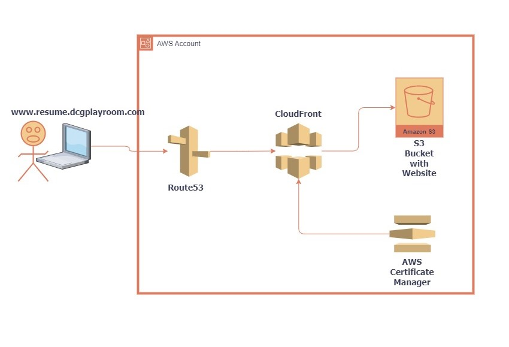

# Cloud-Resume-Challenge-Frontend

## Architectural Diagram ##

## Description ##

The Cloud Resume Challenge is a popular learning project that provides hands-on experience with various AWS (Amazon Web Services) services and helps individuals showcase their skills in cloud computing and web development. The challenge involves building a serverless web application using AWS services.

**Here's a brief description of the Cloud Resume Challenge in AWS:**

Objective: The main objective of the Cloud Resume Challenge is to create a personal resume website hosted on AWS using serverless technologies.

Serverless Architecture: The challenge encourages participants to design their resume website using a serverless architecture. This means leveraging AWS services like AWS Lambda, Amazon S3, Amazon API Gateway, Amazon DynamoDB, and AWS CloudFormation.

Resume Website: Participants are required to design and develop a static website that showcases their resume, skills, projects, and contact information. The website can be built using HTML, CSS, and JavaScript.

Infrastructure as Code: The Cloud Resume Challenge emphasizes the use of Infrastructure as Code (IaC) principles. Participants are encouraged to use AWS CloudFormation to provision and manage their AWS resources, ensuring that the infrastructure is easily reproducible.

AWS Services: Participants are expected to leverage various AWS services to build their resume website. This may include using AWS Lambda for serverless functions, Amazon S3 for hosting static assets, Amazon API Gateway for creating REST APIs, Amazon DynamoDB for storing data, and AWS Identity and Access Management (IAM) for managing access and permissions.

Deployment and Automation: Participants should automate the deployment process using CI/CD (Continuous Integration/Continuous Deployment) principles. Tools like AWS CodePipeline, AWS CodeCommit, and AWS CodeBuild can be utilized to automate the build, test, and deployment phases.

Custom Domain and SSL: As an extra challenge, participants can configure a custom domain for their resume website using AWS Route 53 and obtain an SSL certificate using AWS Certificate Manager for secure HTTPS communication.

The Cloud Resume Challenge offers a practical way to learn and demonstrate proficiency in building cloud-based applications using AWS services. It provides an opportunity to gain hands-on experience, showcase skills to potential employers or clients, and contribute to an active community of learners participating in the challenge.

## Challenges ##

Firstly I would like to thank the facilitators of the these Cloud Resume Challenge. During the course of building my online resume using AWS, I would say it was challenging and also entertaining before I had to read through the AWS documentation to find out which was resources I would deploy and when.

Suffice to say, I had mininal challenges around the way, not because the challenge was not difficult but I already have a number of years doing cloud security and I am conversant with most of the resources in AWS.
